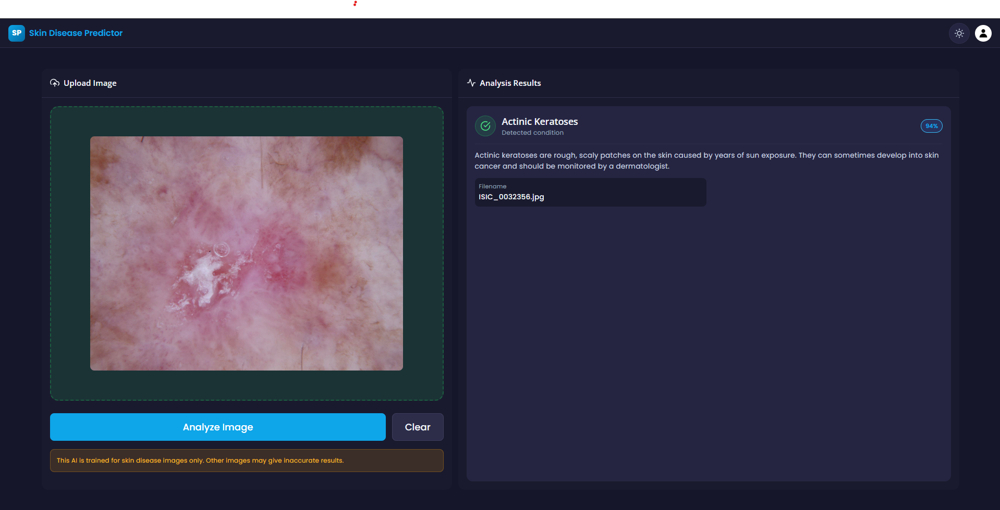

# 🧠 Skin Disease Detection Using Deep Ensemble Learning


---

## 📸 Screenshot



---

## 📋 Overview

A web-based system to detect skin diseases from images using deep learning. The project uses **ensemble learning with CNN architectures** to improve diagnostic accuracy.

Users can upload a skin image, and the backend uses three trained CNNs (EfficientNetB3, ResNet101, DenseNet121) to classify it. The predictions are averaged to determine the final result.

---

## ✨ Features

- 🖼️ Upload dermatoscopic images for prediction  
- 🧠 Ensemble of EfficientNetB3, ResNet101, and DenseNet121  
- ✅ JWT-based authentication system (register/login)
- 📊 Confidence score for each prediction
- 📖 Description of predicted skin condition
- 📱 Responsive UI using React 18

---

## 🛠️ Tech Stack

### 🔙 Backend
- Python 3.12
- Flask + Flask-JWT-Extended
- TensorFlow / Keras
- MongoDB (via PyMongo)
- OpenCV & Albumentations for preprocessing
- dotenv for environment configs

### 🔜 Frontend
- React 18
- Axios
- React Router DOM
- Styled Components
- React Icons

---

## 📁 Project Structure (Simplified)

```
skin_disease_detection/
├── backend/
│ ├── app/ # Backend app logic
│ ├── main.py # Flask app entry
│ ├── requirements.txt # Python dependencies
│ └── uploads/ # Uploaded images
├── frontend/
│ └── src/ # React app
├── trained_models/ # Pretrained .h5 models
└── README.md
```


---

## 📊 Dataset

- Dataset: [HAM10000 (Kaggle)](https://www.kaggle.com/datasets/kmader/skin-cancer-mnist-ham10000)
- 10,000 labeled images across 7 classes:
  - `akiec`, `bcc`, `bkl`, `df`, `mel`, `nv`, `vasc`

To prepare:
- Extract dataset into:  
  `backend/data/skin_disease_dataset/base_dir/`  
  with subdirectories: `train_dir/`, `val_dir/`, `test_dir/`

---

## 🧠 Model Details

- Ensemble of:
  - ✅ DenseNet121
  - ✅ EfficientNetB3
  - ✅ ResNet101
- Each model is trained independently.
- Final prediction: average of softmax scores from all 3 models.

### 📥 Download Trained Models

Download the pre-trained models from Google Drive:

🔗 [Download Models](https://drive.google.com/file/d/1RdJgiNy94sM2OfU3N6RqFbDBD-BawNYY/view)

After downloading, extract and place the `trained_models` folder in the project root directory:

```
skin_disease_detection/
├── backend/
├── frontend/
├── trained_models/      ← Place here
│   ├── densenet121.h5
│   ├── efficientnetb3.h5
│   └── resnet101.h5
└── README.md
```


---

## 🔐 Authentication

- JWT-based login/register system
- Tokens must be passed in `Authorization` header for prediction requests.

---

## 🧪 API Endpoints

| Endpoint            | Method | Auth | Description                  |
|---------------------|--------|------|------------------------------|
| `/auth/register`    | POST   | ❌   | Register a new user         |
| `/auth/login`       | POST   | ❌   | Login, receive JWT token    |
| `/predict`          | POST   | ✅   | Upload image & get results  |

---

## 🚀 Getting Started

### 🧰 Prerequisites

- Python 3.12+
- Node.js v18+
- MongoDB (local or cloud)
- Git

---

### ⚙️ Backend Setup

```bash
# Navigate to backend
cd backend

# Create virtual environment
python -m venv venv

# Activate virtual environment
# On Windows:
venv\Scripts\activate
# On macOS/Linux:
source venv/bin/activate

# Install dependencies
pip install -r requirements.txt
```

### 🔑 Environment Configuration

Copy the unified environment template from project root:
```bash
cp .env.example .env
```
Edit `.env` to configure your Flask secret keys, MongoDB URI, and Frontend API URL.

For detailed production deployment instructions (MongoDB Atlas, Render, Vercel, Docker), see the [Deployment Guide](docs/deployment-guide.md).

### (Optional) Train Your Own Models

If you want to train the models yourself instead of using the pre-trained ones:

1. Download raw HAM10000 dataset from Kaggle and extract into `backend/data/raw/` (containing `HAM10000_metadata.csv` and image folders).
2. Run the **Automated Dataset Preparation Script**:
   ```bash
   python backend/data/prepare_dataset.py
   ```
   *This automatically performs stratified splitting (80% train, 10% val, 10% test) and organizes images into the 7 disease class subfolders (`akiec`, `bcc`, `bkl`, `df`, `mel`, `nv`, `vasc`).*

```bash
python main.py
```

### 🌐 Frontend Setup
```bash 
cd frontend
npm install
npm start
```

### 🧪 Prediction Flow
```bash
Login → Receive JWT token

Upload skin image

Backend runs predictions using all 3 models

Softmax probabilities are averaged

Highest scoring class is selected

Response includes:

Predicted disease

Confidence score

Disease name + description
```

### 📄 License

MIT License See [LICENSE]() file.


### 🙋 Contact

[@Purvesh-PJ](https://github.com/Purvesh-PJ) 


### 📚 Additional Documentation

Detailed project documentation is available in the `docs/` folder:

- **[Architecture Overview](docs/architecture.md)** - System design and component breakdown
- **[Working Flow](docs/working-flow.md)** - End-to-end process flows
- **[Modules Documentation](docs/modules.md)** - Detailed module and component reference
- **[Frontend Flow](docs/frontend-flow.md)** - React architecture and patterns
- **[Backend Flow](docs/backend-flow.md)** - Flask API and request lifecycle
- **[API Overview](docs/api-overview.md)** - Complete API endpoint reference
- **[Interview Notes](docs/interview-notes.md)** - Interview preparation guide
- **[Improvements](docs/improvements.md)** - Future enhancements and recommendations

---

### 🙏 Acknowledgements

- [Kaggle HAM10000 Dataset](https://www.kaggle.com/datasets/kmader/skin-cancer-mnist-ham10000)
- [TensorFlow](https://www.tensorflow.org/)
- [React](https://react.dev/)
- [Flask](https://flask.palletsprojects.com/en/stable/)
